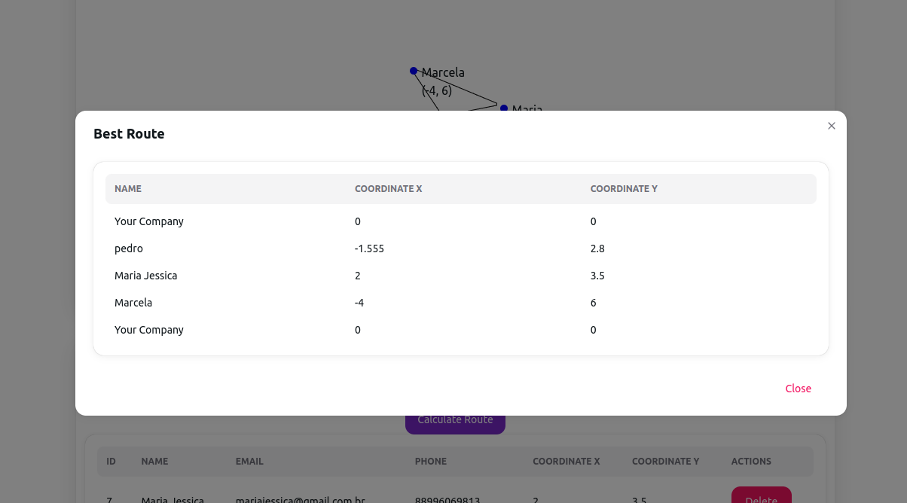
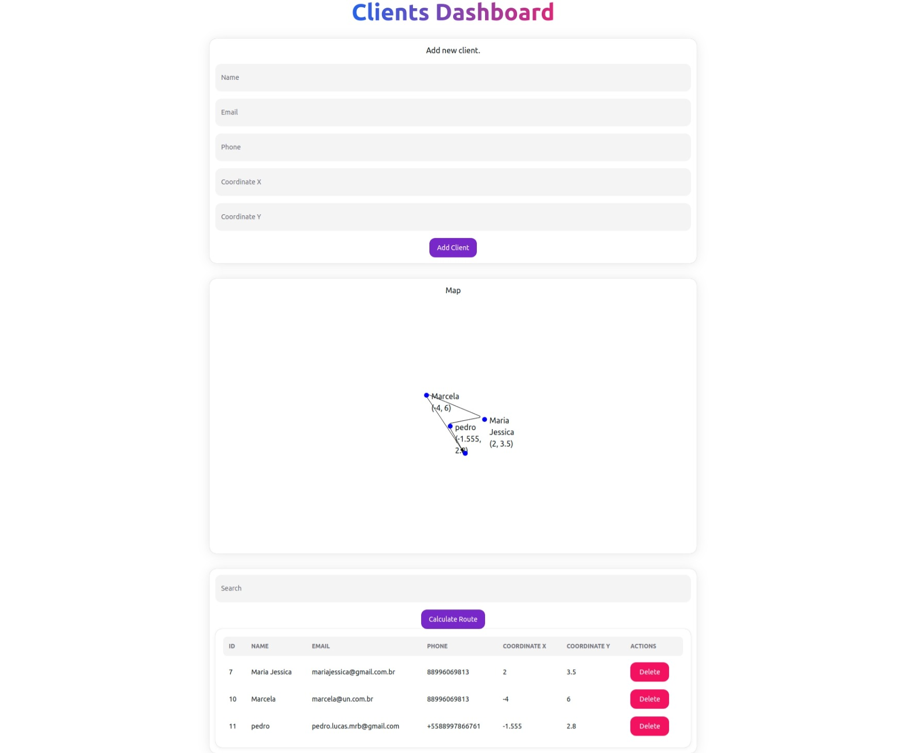

# Best Route Challenge

This project implements an approach to the traveling salesman problem, in the context of a cleaning company that needs to calculate the best route to visit all of its customers.

## Requirements

- [PostgreSQL](https://www.postgresql.org/) (version 16.1)
- [Node.js](https://nodejs.org/) (version 18.19.0)

## Database Configuration

1. Make sure you have PostgreSQL installed and running.
2. Create a database in PostgreSQL.
3. Use the file [best-route-ddl.sql](https://github.com/pl-90/best-route-challenge/blob/main/best-route-ddl.sql) to generate the structure of Databse.

## Backend Installation/Configuration on localhost:
1. Navigate to the project directory:
    ```bash
    cd best-route-backend
    ```
2. Create the .env file in the root of the backend and fill it with the connection data to your database:
   ```bash
    DB_USER=<your-db-user>
    DB_HOST=localhost
    DB_NAME=<your-database-name>
    DB_PASSWORD=<your-bd-password>
    DB_PORT=<your-db-port>
   ```
3. Install project dependencies with npm:
   ```bash
    npm install
    ```
4. Server start:
   ```bash
    npm run dev
    ```
   
The backend will be available at [http://localhost:3333/](http://localhost:3333/).

## Frontend Installation/Configuration on localhost:
1. Navigate to the project directory:
    ```bash
    cd best-route-frontend
    ```
3. Install project dependencies with npm:
   ```bash
    npm install
    ```
4. Server start:
   ```bash
    npm run dev
    ```
   
The frontend will be available at [http://localhost:5173/](http://localhost:5173/).

## Screenshots




